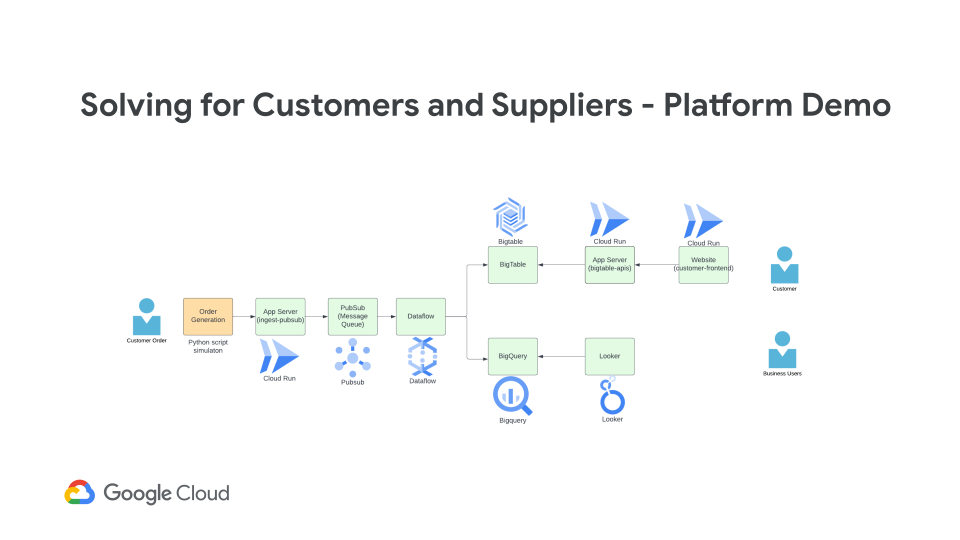
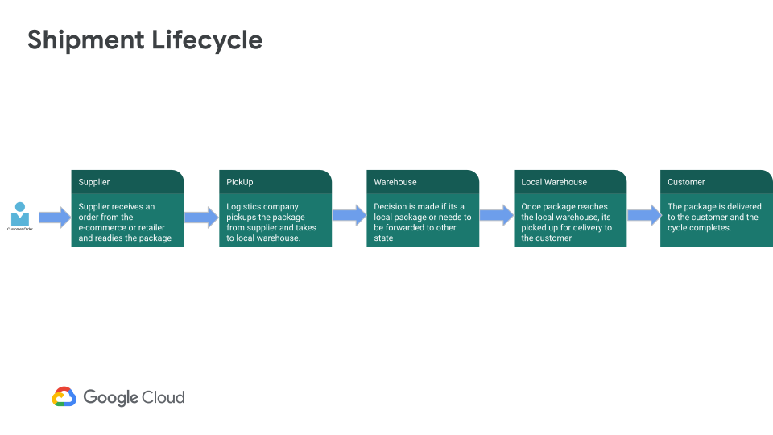

# Features

## Pitch Deck

The pitch deck can be found at [go/vitamin-g-logistics-demo](http://go/vitamin-g-logistics-demo)

## Architecture

The end to end component architecture is as below:

## User Case

### Business
In today's world, we have a lot of e-commerce companies across the globe and mobile app/website has become a retail shop that can be accessed sitting at home/office etc. One of the key components across these companies is how the deliver the orders and thereby connecting the suppliers and efficiently delivering the order to end customers.

The end to end journey of the order looks somewhat like below:

Logistics company face a lot of challenges when they recieve the data late in terms of the status of the orders. It will be a great business kpi for them to capture , analyze and process the data generated at each stage in real time.

### Technical
The idea for building the end to end demo was to demonstrate below technical capabilities:
1. Building an end to end data pipeline with managed services and serverless components.
2. Ability to capture , process , ingest data in real time into datawarehouse i.e. BigQuery and NoSQL database i.e. BigTable.
3. Demonstrate the use case to differentiate between selection of BigQuery and BigTable.
4. Demonstrate the capability to load high volume of transactions in real time and process it end to end.
5. Deployment Automation for end to end setup via Terraform.

## Components

### Cloud Run
You can read more about Cloud Run at [https://cloud.google.com/run](https://cloud.google.com/run)

As part of this demo, Cloud Run has been used for 3 different purposes:

1) Generating test harness data for the demonstrattion.

2) Hosting the front-end UI to fetch data specific to a package id.

3) Hosting APIs to fetch data from BigTable for a specifc package id. 
### PubSub
You can read more about PubSub at [https://cloud.google.com/pubsub](https://cloud.google.com/pubsub)

The test harness data that is being generated is published to PubSub in real time.
### Dataflow
You can read more about at Dataflow at [https://cloud.google.com/dataflow](https://cloud.google.com/dataflow)

The streaming data pipeline is written in Apache Beam using Python SDK and deployed on Dataflow. 
The pipeline reads streaming data in real time from PubSub Topic and performs some basic processing. 
After processing, the data is pushed simultaneously into Cloud Bigtable and BigQuery.
### BigQuery
You can read more about BigQuery at [https://cloud.google.com/bigquery](https://cloud.google.com/bigquery)

The data is streamed directly into BigQuery for real time data analysis. 
The persisted data is partitioned on data and thereby enabling analysis across date segments i.e. day , week , month etc
### BigTable
You can read more about at [https://cloud.google.com/bigtable](https://cloud.google.com/bigtable)

The data is streamed real time into BigTable. There are 2 tables created in BigTable for persisting data i.e. one having data with rowkey as package id and other with rowkey having customer id.
### Looker
You can read more about Looker at [https://cloud.google.com/looker](https://cloud.google.com/looker)

The data from BigQuery can be analysed using Looker for hsitorical and business analysis
