# Installation Steps

## For Argolis Users

### Pre-Steps

1) Log in via the admin user on GCP Argolis console.

2) Open the cloud shell via the GCP console.

3) Clone the repository by running the below command :

    git clone https://github.com/jainsourabh2/logistics.git 

4) Navigate into logistics/terraform directory

    cd logistics/terraform

5) Open the terraform.tfvars file and change the values appropriately. Guidance to find organization and billing-account variables are given further in this step.

    project                 = "<unique_project_name>"
    region                  = "<region-name>"
    zone                    = "<zone-name>"
    folder                  = "logistics-demo"
    organization            = "<12 digit org id>"
    billing-account         = "<XXXXXX-YYYYYY-ZZZZZZ>" 

Navigate to **IAM & Admin** -> **Manage Resources**

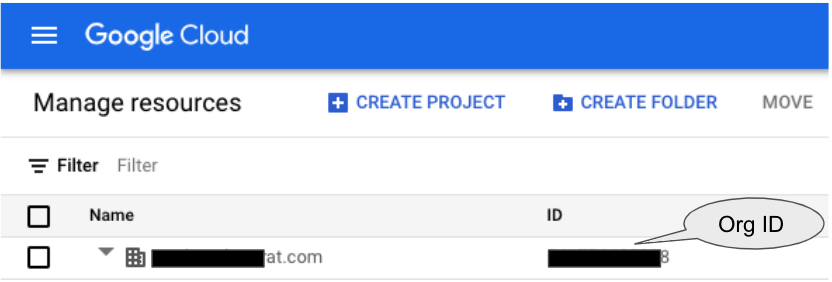

Navigate to Billing Account details from GCP Console Hamburger menu as depicted below:

Click on ** GO TO LINKED BILLING ACCOUNT**

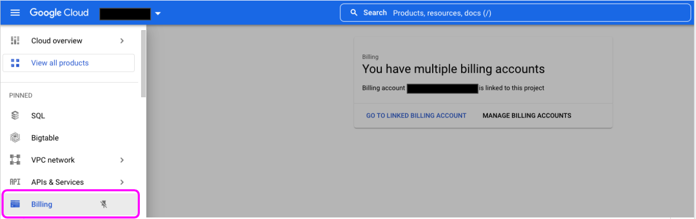

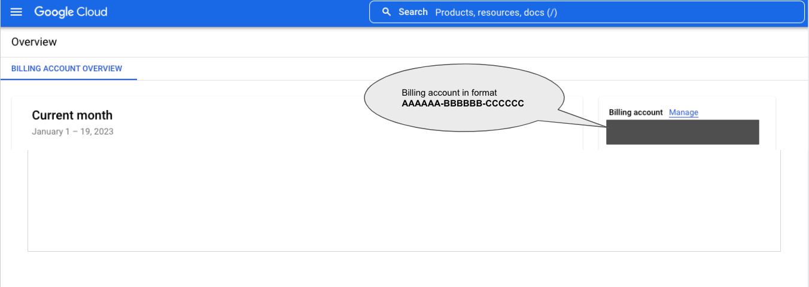

### Terraform Deployment Steps

6) Run the below command to initialize terraform.

    terraform init

7) Run the below command to validate the structure of terraform 

    terraform validate

   You can optionally/additonally also run **terraform plan** to get a view of actions that will be performed.

8) Run the below command to apply changes in your project.

    terraform apply

  Once you run the above command, you would be asked for confirmation. Please respond with a "yes" to proceed further.

  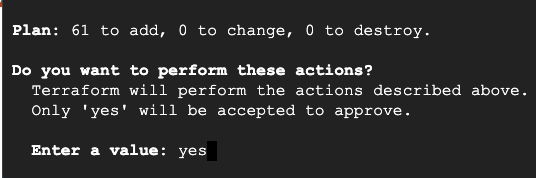

  Terraform Deployment completed message

  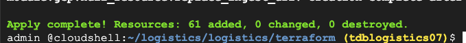

### Post Terraform Deployment

**NOTE : In Argolis, by default org policy blocks unauthenticated access and hence the policy (constraints/iam.allowedPolicyMemberDomains) needs to be allowed and then unauthenticated access needs to be enabled on the cloud run URLs**

Navigate to **IAM & Admin** -> **Organization Policies** 

Search for **Domain Restricted Sharing** policy and Edit is as shown in the screenshot (1,2,3,4,5 depict the sections on this form where values need to be edited)

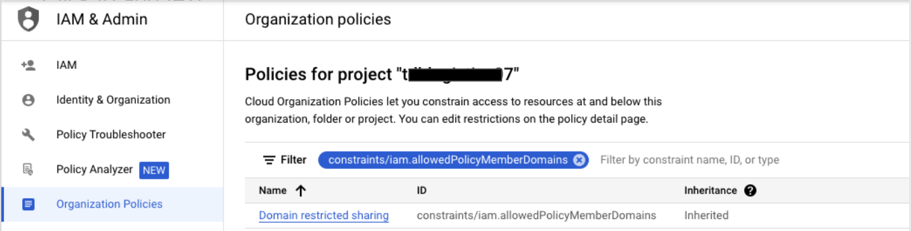

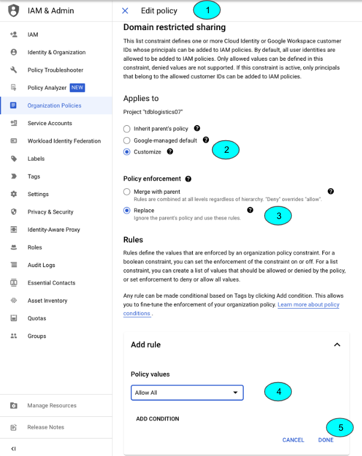

Finally, click **Save** to persist the change to the policy.

9) Post the deployment , provide the permissions to allow unauthenticated access to the 3 Cloud Run API services. 

  **From**:

  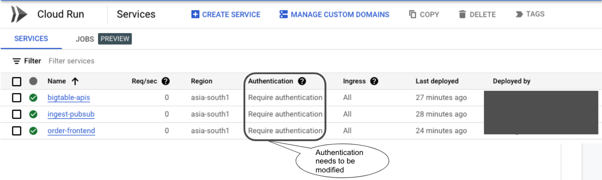

  **To**:

  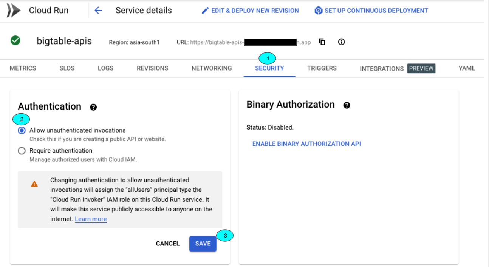

  The above screenshot covers only one (bigtable-apis) of the 3 Cloud Run services. However, the process needs to be repeated for remaining 2 services as well (ingest-pubsub, order-frontend)

  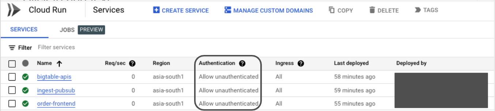

10) Generate Dummy Orders using the test harness

Navigate to the logistics-->test-harness folder in cloud shell. (Ensure the project of cloud shell is set to the Newly created project as part of this demo).
Run the python script as depicted in the screenshot below. It will generate 50 orders by default.

  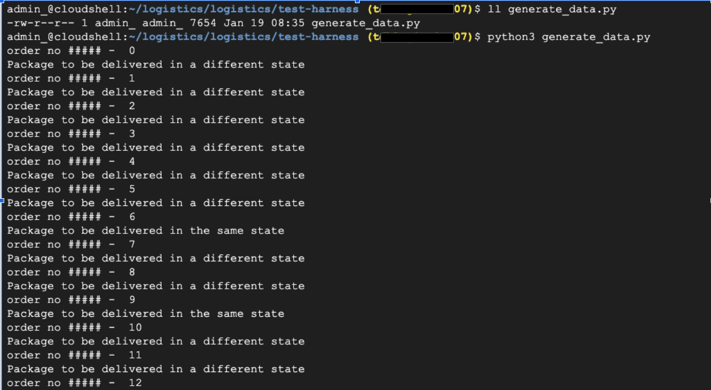

NOTE: If you need to generate more orders, the same can be done by editing the generate_data.py script's line that otherwise looks like-

`for x in range(50):`

Change the value of 50 to any other desired number, save the file and run the generate_data.py script

11) View the data in BigQuery tables

Navigate to the new project in GCP Console and open BigQuery
Drill down to the `logistics` dataset and `logistics` table therein.

Query it from query tab as shown in the screenshot below.
Grab one of the sample package_id column values of `logistics` table; the same will be used to query from Customer Package tracking Console meant for end-user.

   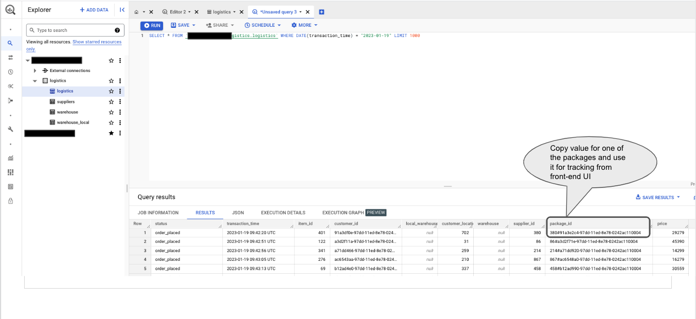

### Demo (Frontend Console & Looker)

12) Query from Front-end console

This particular functionality for Real-time low latency tracking of package is facilitated by **Bigtable** as the backend datastore.

Navigate to Cloud Run and click on the `order-frontend` Service and copy the URL as shown in the below screenshot.

   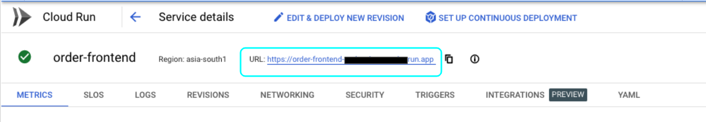

Use the same (or any other) package_id copied during Step 11 and key-in the same into the field `Customer Package Lookup` ID and click on **Latest Location** button.

Package Lookup Result provides the status of the package with latest hop being at the top.

   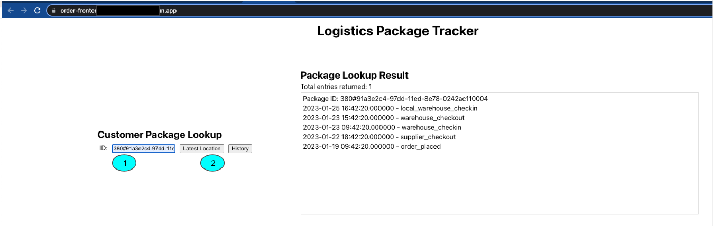

13) Looker based Dashboard Visualization

### Clean-up

14) Purge the Demo Setup

Use the below terraform command from cloud shell to purge all the artefacts created as part of this demo's deployment in GCP.

    cd logistics/terraform

and

    terraform destroy

If you face any errors, please contact xyz@google.com

## For General Users:

